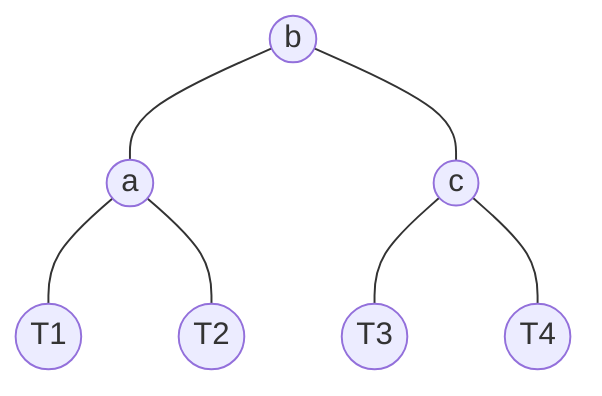

Sometimes, when creating a [[notes/Balanced Binary Search Trees|balanced tree]], [[notes/Binary Tree Rotations|rotations]] may not be sufficient. In this case, a technique called trinode structuring comes in, which is essentially one or two rotations combined. The operation of restructuring from a node $x$ involves these steps:

```
restructure(x):
	let y be the parent and z be the grandparent of x
	let (a, b, c) be these nodes in in-order traversal
	let T1...T4 be the subtrees of each of these nodes.
	restructure the tree so that:
```




![[images/39713D8B-9E7F-4184-9630-515E9CDCD6EE.jpeg]]

> Ignore the colors, here this figure is from an explanation of red-black trees.