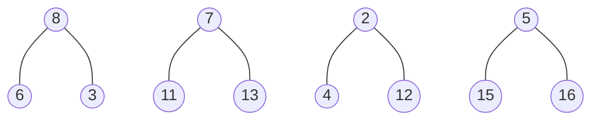
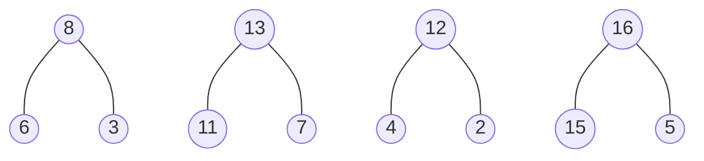
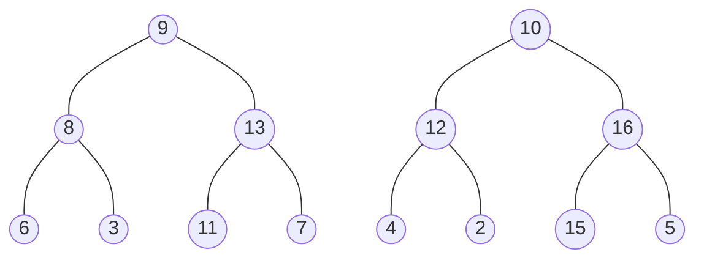
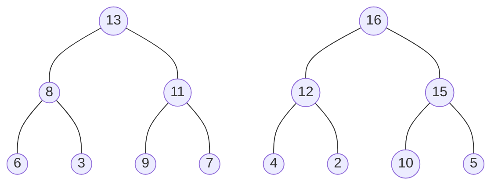
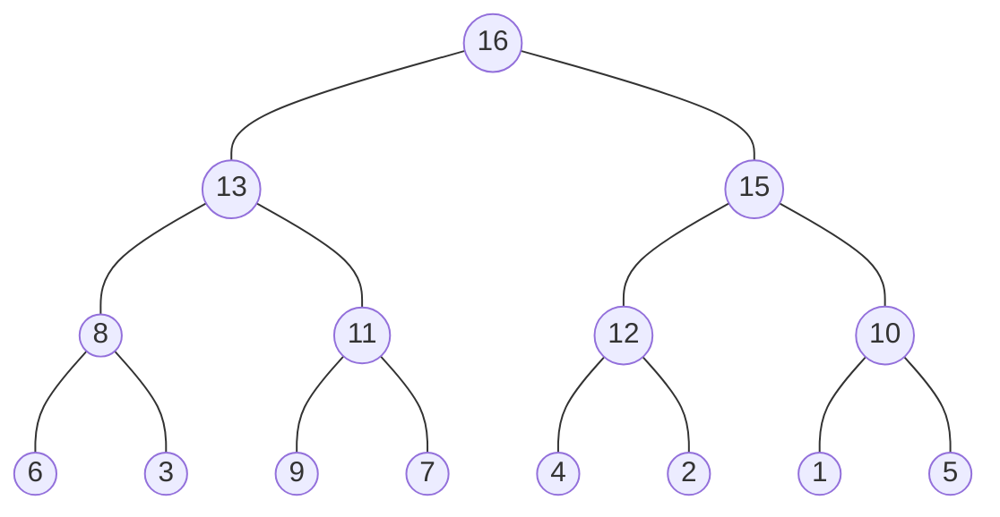

Constructing a heap from scratch by inserting each element into the heap takes $O(nlog(n))$ time. However, when you have a list with $2^n-1$ elements, you can construct a heap with those elements in $O(n)$ time using the following steps.

> The diagrams are for the list `[1,9,10,8,7,2,5,6,3,11,13,4,12,15,16]`

1. Construct $\frac{n+1}{2}$ heaps each with one element 

2. Construct $\frac{n+1}{4}$ heaps each with three elements

3. Apply [[/notes/Down Heap Bubbling|Down-Heap Bubbling]] on each heap.

2. Construct $\frac{n+1}{8}$ heaps each with seven elements

3. Apply [[/notes/Down Heap Bubbling|Down-Heap Bubbling]] on each heap.

4. Finally, add the last element in the list and apply [[/notes/Down Heap Bubbling|Down-Heap Bubbling]] one final time.
