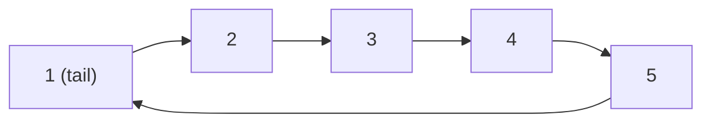

This is another type of specialized [[/notes/Linked List|Linked List]]. Normally in a linked list, the tail node would have the *next* pointer set as null. However, in Circularly Linked Lists, we instead set the tail's next element to head, essentially **circling** back to the start of the list in the end. This approach eliminates the need for a seperate *head* variable in our implementation since *head* is simple `tail.getNext()`. This makes our code more memory-efficient and also makes our logic simpler, causing our code to be easier to read. A circular linked list looks like this:

