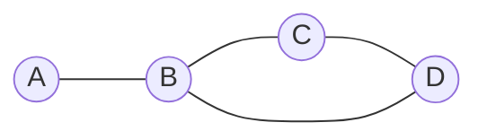
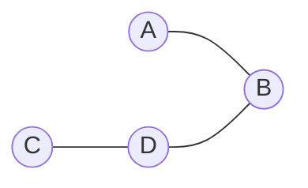

In a network that uses distance vector routing, every router has a **routing table** which contains a list of every single router in the network, as well as the cost of accessing that router and through which of its edges it can access it. Here is an example of a network and its routing tables:

**Routing table for D:**

|Node|Cost|Through|
|----|----|-------|
|A|2|B|
|B|1|B|
|C|1|C|

> [!Warning] Caution
>
> When the path to a router is the same through two different edges, the *through* column is selected according to the protocol policy.

## Count to infinity problem

Consider the graph below:

**B's routing table is like so:**
|Node|Cost|Through|
|----|----|-------|
|A|1|A|
|B|-|-|
|C|2|D|
|D|1|D|

**D's routing table is like so:**
|Node|Cost|Through|
|----|----|-------|
|A|2|B|
|B|1|B|
|C|1|C|
|D|-|-|

Now, consider that A fails, now B sends out a request looking for links to A. As far as D is concerned, it has a path of cost 2 to A through B. So B updates A's cost to $Cost(D)+2=3$. Now both of D's neighbours announce a cost of 3 to a so it updates its cost to 3. After that, B's cost increases again and so on, until the cost of accessing A is $\infty$.
