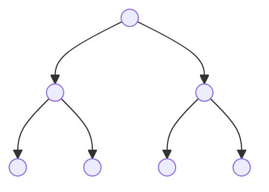
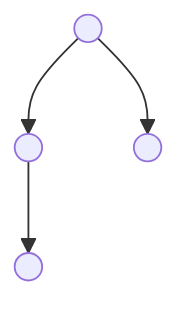
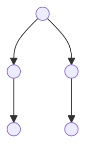

* In a *full*/*complete* [[/notes/Binary Tree|Binary Tree]], every node has two children, except the leaf nodes.
* In a *complete* binary tree however, every level has the maximum number of nodes it can have. The last layer is exempted from this condition. If there are missing leaf nodes, they all have to be on the right.

### A Full Binary Tree

### A Complete Binary Tree

#### This is not a valid complete binary tree:
