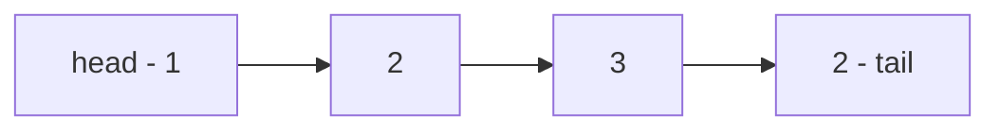

Unlike [[/notes/Array|Array]], linked lists are data structures made up of nodes containing elements and edges connecting those nodes. In a linked list, each node must contain at least two basic fields: the element that the node contains, and a pointer to the next node in the list. However, a node can have more than those basic fields if they are used in a specialized kind of linked list. Linked lists allow adding and removing elements to the start and end of the list at $O(1)$ time, removing them can also be done in $O(1)$ time (removing the tail takes $O(n)$ since we need to start from the head to get the node that references to *tail*. This is not the case in [[/notes/Doubly Linked List|Doubly Linked List]]). However, unless we are accessing the *head* or *tail*, accessing, or adding an element in a linked list takes $O(n)$ time. Here is a basic drawing demonstrating linked lists:

> The type of basic linked list discussed above is commonly called **Singly Linked List**.