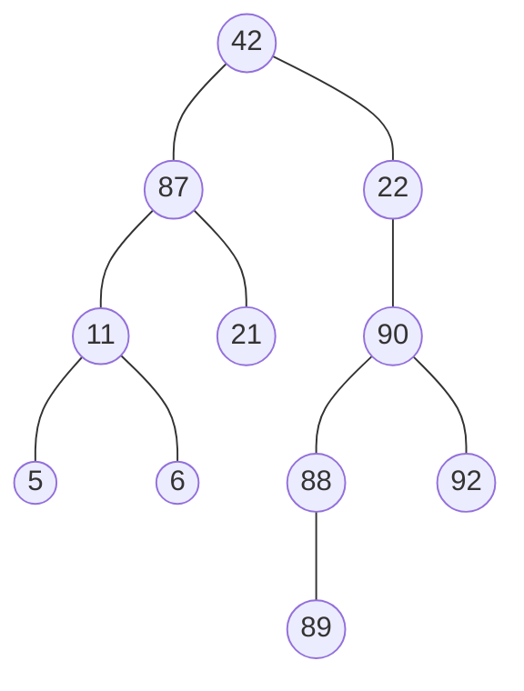

[[/notes/Tree|Tree]]s have some important terminology.

* **Root:** The top node. In this tree it is *42*.
* **Internal Nodes:** Any node in a tree that has child nodes. In this case, they are *42*,*22*,*11*,*87*,*90*.*88*.
* **External Nodes:** Any node without children. So, *5*,*6*,*21*,*92*,*89*.
* **Ancestors:** Ancestors of a node are nodes that have a direct path that goes downwards to it. Every node is an ancestor to itself. The ancestors of node *90* is *87*,*42*,*90*
* **Descendants:** The descendants of a node is all the nodes that this node is an ancestor to. Every node is its own descendant. For the node *90*, its descendants are *90*,*88*, *92*, *89*.
* **Siblings:** A sibling of a node is all the nodes that share the same parent with it. For instance, the nodes *5* and *6* are siblings.
* **Subtree:** Subtrees of a node are trees whose nodes are the children of that node.
* **Depth:** The depth of a node is the number of edges from that node to the root.
* **Height:**  The *longest* path from a node to a leaf.