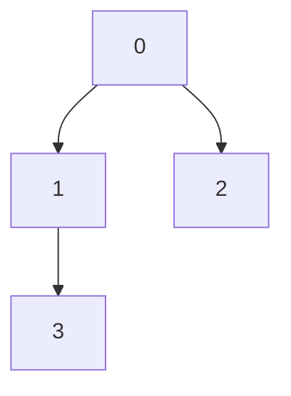

## Tree Representation with Arrays
It is very easy to represent [[Tree]]s using a linked data structures, similar to [[Linked List]]. However, if you want more performance, it is sometimes better to use an [[Array]]. It is easy to calculate the indexes of the parent([[Tree Terminology]]) and (left/right) children using simple arithmetic. If you place each node in an array as such:

We use the following formulas:
* **parent** = $\frac{i-1}{2}$
* **left child** = $2i + 1$
* **right child** = $2i + 2$